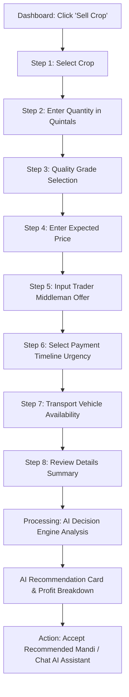

# 🌾 AgroPrice AI — Phase 1: User Flows & Wireframe Specifications

## 1. Primary User Flow: 8-Step Sell Crop Engine



---

## 2. Key Wireframe Specifications

### Wireframe A: Step 8 — Review Details (`/sell/review`)
```
┌────────────────────────────────────────────────────────┐
│ ← Back                                 Step 8 of 8     │
│ 🌾 Review Crop Listing Details                         │
│ Verify your harvest details before calculating AI score │
├────────────────────────────────────────────────────────┤
│ 📦 Crop: Wheat (Grade A)                              │
│ ⚖️ Quantity: 50.0 Quintals                            │
│ 🎯 Target Price: ₹2,400 / Quintal                      │
│ 💵 Middleman Bid: ₹2,150 / Quintal                     │
│ 🚚 Transport: Self Tractor Trolley Available           │
├────────────────────────────────────────────────────────┤
│ [ ⚡ Run AI Recommendation Engine & Calculate Score ]  │
└────────────────────────────────────────────────────────┘
```

---

### Wireframe B: AI Recommendation Result (`/sell/recommendation`)
```
┌────────────────────────────────────────────────────────┐
│ 🌾 AgroPrice AI Decision Engine                       │
├────────────────────────────────────────────────────────┤
│  ┌──────────────────────────────────────────────────┐  │
│  │   AI DECISION SCORE: 92 / 100                    │  │
│  │   RECOMMENDATION: ⚡ SELL TODAY AT INDORE MANDI  │  │
│  └──────────────────────────────────────────────────┘  │
│                                                        │
│ 📊 Profit Analysis                                     │
│ • Gross Revenue: ₹1,22,500                             │
│ • Logistics & Fuel: -₹3,200                            │
│ • Mandi Fee & Labor: -₹1,800                           │
│ --------------------------------                      │
│ • ESTIMATED NET PROFIT: ₹1,17,500 (MAXIMIZED)          │
│                                                        │
│ 💡 AI Insights:                                        │
│ "Indore Mandi arrivals down 14% today, driving modal   │
│ prices up by ₹120/quintal. Transporting self saves     │
│ ₹4,000 compared to trader pickup."                     │
│                                                        │
│ [ 📍 View Indore Mandi Directions ]                     │
│ [ 💬 Chat with AI Negotiation Helper ]                 │
└────────────────────────────────────────────────────────┘
```
